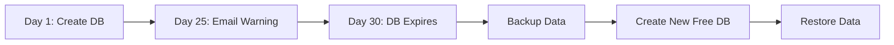

# Render.com Deployment Guide

> **Complete step-by-step guide to deploy Vira Services to Render.com for FREE**

## 🎯 **Why Render.com?**

✅ **Truly Free Tier** (not trial)  
✅ **750 free hours/month** for web services  
✅ **1GB PostgreSQL database** for 30 days  
✅ **Native Spring Boot support**  
✅ **GitHub auto-deployment**  
✅ **Custom domains + HTTPS**  
✅ **Perfect for personal projects with <5 users**

---

## 🚀 **Step-by-Step Deployment**

### **Prerequisites ✓**
- ✅ Render.com account (free)
- ✅ GitHub repository with your code
- ✅ `render.yaml` configuration file (included)

---

### **Step 1: Deploy to Render Dashboard**

1. **Login to Render**
   - Go to [render.com](https://render.com)
   - Sign in with your account

2. **Create New Project**
   - Click **"New"** → **"Blueprint"**
   - Connect your GitHub account if not already connected
   - Select your `vira-services` repository
   - Render will detect the `render.yaml` file automatically

3. **Review Configuration**
   - Render will show you the services it will create:
     - ✅ **vira-services** (Web Service - Free)
     - ✅ **vira-postgres** (PostgreSQL - Free)
   - Click **"Apply"** to create services

---

### **Step 2: Monitor Deployment**

1. **Watch Build Process**
   - Render will automatically:
     - Clone your repository
     - Run `./mvnw clean package -DskipTests`
     - Create PostgreSQL database
     - Deploy your Spring Boot app

2. **Check Build Logs**
   - Click on **"vira-services"** service
   - Go to **"Logs"** tab
   - Monitor for successful startup messages

3. **Expected Build Time**
   - First build: **5-10 minutes**
   - Subsequent builds: **3-5 minutes**

---

### **Step 3: Verify Deployment**

1. **Get Your App URL**
   - In Render dashboard, click on **"vira-services"**
   - Your app URL will be: `https://vira-services-xxxx.onrender.com`

2. **Test Health Check**
   ```bash
   curl https://your-app-url.onrender.com/actuator/health
   ```
   Expected response: `{"status":"UP"}`

3. **Test API Documentation**
   - Visit: `https://your-app-url.onrender.com/swagger-ui/index.html`
   - You should see your complete API documentation

4. **Test Admin Login**
   ```bash
   curl -X POST https://your-app-url.onrender.com/api/auth/login \
     -H "Content-Type: application/json" \
     -d '{"username":"admin","password":"SecureAdmin123!"}'
   ```

---

### **Step 4: Environment Variables (Optional Customization)**

If you want to change any settings:

1. **Go to Service Settings**
   - Click on **"vira-services"** → **"Environment"**

2. **Key Variables You Can Modify:**
   ```bash
   JWT_SECRET=your-custom-secret-here
   ADMIN_PASSWORD=your-secure-password
   FRONTEND_URL=https://your-frontend-domain.com
   ```

3. **Apply Changes**
   - Click **"Save Changes"**
   - Service will redeploy automatically

---

## 🗄️ **Database Management**

### **Database Connection Info**
- **Host**: Automatically configured via `DATABASE_URL`
- **Database**: `vira_db`
- **User**: Auto-generated
- **Password**: Auto-generated
- **SSL**: Enabled by default

### **Access Database (Optional)**
1. Go to **"vira-postgres"** service in Render
2. Click **"Connect"** to get connection details
3. Use any PostgreSQL client (pgAdmin, DBeaver, etc.)

### **30-Day Database Lifecycle**


**Backup Strategy:**
```bash
# Export data before day 30
pg_dump $DATABASE_URL > backup.sql

# After creating new database
psql $NEW_DATABASE_URL < backup.sql
```

---

## ⚡ **Performance & Limitations**

### **Web Service (Free Tier)**
- ✅ **750 hours/month** (≈ 31 days continuous)
- ⚠️ **Spins down after 15 minutes** of inactivity
- ⚠️ **~1 minute cold start** time
- ✅ **Custom domains** supported
- ✅ **HTTPS** included

### **PostgreSQL (Free Tier)**
- ✅ **1GB storage** (sufficient for your use case)
- ✅ **Full PostgreSQL features**
- ⚠️ **30-day expiration** (renewable)
- ⚠️ **No backups** (manual export required)

### **Perfect For:**
- Personal portfolios
- Small business apps
- Development/testing
- Up to 5 users
- Low-traffic applications

---

## 🔐 **Security Configuration**

### **Production Security Checklist**
- ✅ **HTTPS** enabled by default
- ✅ **JWT secret** configured
- ✅ **Admin password** set
- ✅ **Database SSL** enabled
- ✅ **CORS** configured for production

### **Update CORS for Your Frontend**
When you deploy your React frontend, update the environment variable:
```bash
FRONTEND_URL=https://your-actual-frontend-domain.com
```

---

## 🛠️ **Troubleshooting**

### **Common Issues & Solutions**

**Build Fails:**
```bash
# Check Java version in logs
# Our config uses Java 17 (correct for Spring Boot 3.2.0)
```

**App Won't Start:**
```bash
# Check environment variables
# Verify DATABASE_URL is set correctly
```

**Database Connection Issues:**
```bash
# Verify PostgreSQL service is running
# Check database environment variables
```

**Slow Response:**
```bash
# Normal for free tier (cold starts)
# Consider upgrading to paid tier for production
```

---

## 💰 **Upgrading (Future Considerations)**

### **When to Upgrade:**
- Need faster cold starts
- Require more than 1GB database
- Need database backups
- Want 24/7 availability

### **Paid Plans:**
- **Web Service**: $7/month (no cold starts)
- **PostgreSQL**: $15/month (persistent, backups)

---

## 🎯 **Next Steps After Deployment**

1. ✅ **Save your production URLs**
2. ✅ **Test all API endpoints**
3. ✅ **Deploy React frontend** (Netlify/Vercel)
4. ✅ **Set up database backup routine**
5. ✅ **Monitor usage in Render dashboard**

---

## 📚 **Useful Commands**

### **Local Development**
```bash
# Test against production API
export API_URL=https://your-app-url.onrender.com
curl $API_URL/actuator/health
```

### **Database Operations**
```bash
# Connect to production database
psql $DATABASE_URL

# Export production data
pg_dump $DATABASE_URL > production_backup.sql

# Check database size
SELECT pg_size_pretty(pg_database_size('vira_db'));
```

---

## 🎉 **Congratulations!**

Your **Vira Services** backend is now deployed and running on Render.com for FREE! 

**Your Live URLs:**
- 🌐 **API**: `https://vira-services-xxxx.onrender.com`
- 📚 **Docs**: `https://vira-services-xxxx.onrender.com/swagger-ui/index.html`
- 🔍 **Health**: `https://vira-services-xxxx.onrender.com/actuator/health`

**Ready for production use with up to 5 users!** 🚀 